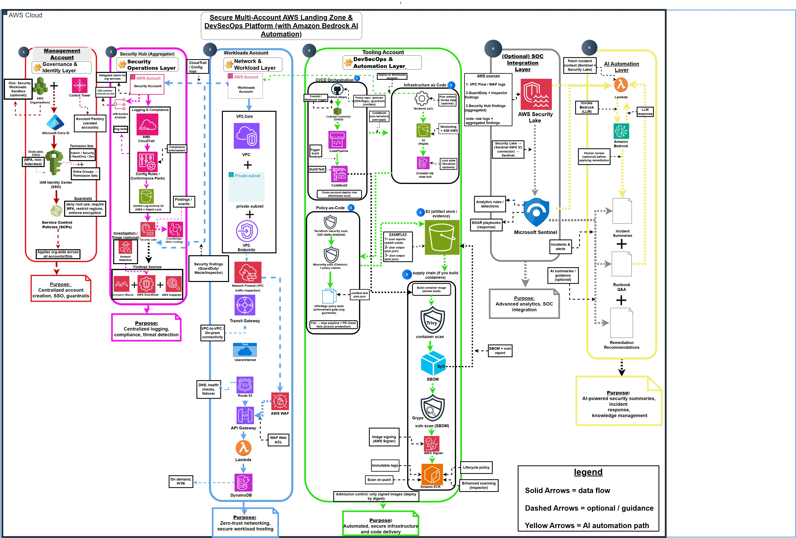

# Secure Multi-Account Landing Zone & DevSecOps Platform (with Amazon Bedrock AI Automation)

## Demo / Portfolio Mode (Read First)
This repository is designed as a portfolio demonstration of a secure AWS multi-account foundation and DevSecOps patterns.
- All identifiers (account IDs, emails, ARNs) are redacted in screenshots.
- No live credentials are stored in this repository.
- Terraform content is provided as an IaC scaffold to illustrate structure and patterns; connecting remote state and performing apply requires your own AWS account configuration.
  
This project documents a secure, enterprise-style AWS cloud foundation using a multi-account structure, zero-trust networking, centralized logging, and an automated DevSecOps pipeline. It integrates federated SSO (Azure Entra ID → AWS IAM Identity Center), enforces least privilege and encryption-by-default, and demonstrates how detection, response, and compliance workflows can be standardized across accounts.

## What this demonstrates
- **A real-world landing zone pattern** (Management / Security / Workloads + shared services)
- **Security-by-default guardrails** (SCPs, identity boundaries, centralized visibility)
- **Operational security** (detections → triage → runbooks → evidence)
- **Cost-aware design choices** (log retention, SIEM/query patterns, NAT egress, service scope)
- **Optional AI automation** (Bedrock-style summarization / incident report drafting)

---

## Key features
- **Multi-account structure:** Management, Security, and Workloads accounts via AWS Organizations + Control Tower patterns
- **Federated SSO:** Azure Entra ID integration with AWS IAM Identity Center
- **Zero Trust networking:** Private subnets, VPC endpoints, Network Firewall/WAF (conceptual placement)
- **Centralized logging:** Org-wide CloudTrail + AWS Config; secure S3 storage patterns (KMS, Object Lock where applicable)
- **Security operations:** Security Hub, GuardDuty, Inspector, Macie, Security Lake (conceptual integration)
- **DevSecOps pipeline:** IaC + scanning + policy-as-code + reporting (portfolio scaffolding)
- **Demo workload (optional):** API Gateway → Lambda → DynamoDB (secure baseline pattern)
- **AI automation (optional):** Summarize findings, draft incident reports, support natural-language Q&A on runbooks

---

## Repo map (where things are)
- `docs/diagrams/` — architecture diagrams (PNG/JPG + optional editable source)
- `docs/decisions/` — ADRs (why key choices were made)
- `docs/runbooks/` — incident response playbooks
- `docs/evidence/` — screenshots/log excerpts (“proof artifacts”)
- `infra/terraform/` — IaC scaffolding (placeholders until implemented)

---

## Architecture diagram
> Current rendered diagram:

> If you later move the diagram under `docs/diagrams/`, update the path above to:
``

---

## How decisions are documented (ADR method)
We document key architecture decisions using ADRs. Each ADR answers:
1. Which alternatives were considered?
2. Why this choice was selected (security / operability / cost / delivery speed)?
3. How trade-offs were balanced (performance vs cost vs security)?

See: `./docs/decisions/`

---

## Evidence (portfolio)
- Architecture diagram: `architecture.jpg` (repo root)  
- ADRs: `docs/decisions/`
- Runbooks: `docs/runbooks/`
- Evidence (screenshots/logs): `docs/evidence/`

> Note: redact account IDs, emails, access keys/secrets, internal hostnames/IPs where needed.

---

## Business perspective (value + cost)

### Why a business would pay for this
This platform reduces operational risk and improves audit readiness:
- **Lower breach likelihood** via centralized controls (SCP guardrails, least privilege, continuous monitoring)
- **Faster incident response** with Security Hub + GuardDuty/Inspector findings feeding runbooks
- **Audit/compliance efficiency** via centralized evidence (CloudTrail/Config + secure S3 archive patterns)
- **Developer velocity with safety** (DevSecOps pipeline + policy-as-code + supply-chain scanning)
- **Executive visibility** through consistent security reporting across accounts/environments

### Monthly cost model (what drives spend)
Monthly running cost is dominated by a small set of drivers:

1) **Logging & retention**
- CloudTrail / Config / VPC Flow Logs / Security Lake storage & query
- Longer retention + higher log volume ⇒ higher cost

2) **Security services**
- Findings volume + number of resources/accounts affects GuardDuty, Inspector, Macie, Security Hub

3) **Network egress / NAT**
- NAT Gateway hourly + data processing can become a major cost in private subnet designs
- Using VPC endpoints reduces NAT usage for AWS service traffic

4) **CI/CD + scanning**
- Artifact storage, container scanning, SBOM generation, pipeline run frequency

5) **AI automation (optional)**
- If enabled, cost depends on how many incidents/findings are summarized and the size of prompts/responses

### Practical cost ranges (order-of-magnitude)
- **Small lab / portfolio demo:** low, if log volume is tiny and retention is short
- **Small business (2–5 accounts):** moderate if Security Hub/GuardDuty/Inspector are enabled and logs retained
- **Enterprise (many accounts + high logging):** cost grows mainly with log volume, retention, and SIEM/query usage

> Biggest cost “knobs”: log retention, Security Lake/SIEM query patterns, NAT usage, and service scope (Macie/Inspector coverage).

### How to estimate properly (what you’d do in a real org)
- Use a pricing calculator with assumptions:
  - number of accounts
  - GB/day of logs (CloudTrail, VPC Flow Logs, app logs)
  - retention period (days/months)
  - number of workloads/resources scanned
  - incident volume for optional AI summaries
- Track spend with tagging (env/account/team) + budgets + alerts per account.

---

## Project status
- ✅ Architecture + documentation complete
- 🟨 IaC scaffolding in progress
- ⬜ Full deployment optional (not required for portfolio review)

---

## Next improvements (recommended)
- Add CI badge + license badge
- Add a short “Results / What this proves” section with 1–2 screenshots in `docs/evidence/`
- Flesh out 1–2 runbooks with realistic steps + tooling references
- Replace placeholder ADR templates with filled ADRs tied to your exact design
