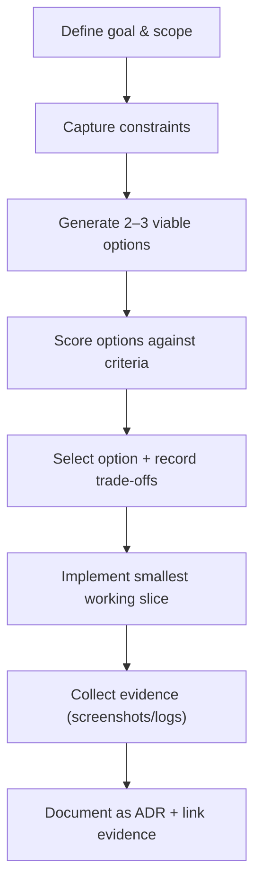

# Decision-making process (ADRs) + tool selection rationale

This repo uses **Architecture Decision Records (ADRs)** to document *why* key architecture choices were made.
Each ADR answers three recruiter-friendly questions:

1. **Which alternatives were considered?**
2. **Why was this choice selected?** (security / operability / cost / delivery speed)
3. **How were trade-offs balanced?** (performance vs cost vs security)

---

## 1) Decision workflow used (repeatable method)

## 2) Decision criteria used (what “good” looked like)

For each major decision, options were scored against these criteria:

- **Security:** least privilege, strong defaults, encryption, auditability, policy-as-code compatibility
- **Operability:** centralized visibility, alerting, fast incident triage, low manual work
- **Cost:** predictable pricing, minimize always-on services, use managed services where possible
- **Delivery speed:** faster to implement and iterate using IaC + managed services
- **Scalability:** multi-account ready; supports growth without redesign
- **Compliance/Audit:** evidence generation (logs/findings), traceability from decision → control → proof

## 3) Tool selection rationale (why these AWS services)

### 3.1 Landing zone + account structure
- **Chosen:** AWS Organizations + multi-account landing zone approach
- **Alternatives considered:** single account; multiple accounts without standard guardrails
- **Why:** separation of duties, blast-radius reduction, consistent governance at scale
- **Trade-offs:** higher setup complexity, but much stronger security and scalability

### 3.2 Central logging and audit trail
- **Chosen:** CloudTrail + centralized CloudWatch Logs (and/or Security Lake later)
- **Alternatives considered:** per-account logs only; manual export
- **Why:** one place to investigate, long-term retention, audit-ready evidence
- **Trade-offs:** more upfront wiring, but investigations become faster and repeatable

### 3.3 Threat detection + posture management
- **Chosen:** Security Hub + GuardDuty as the “detect + aggregate” layer
- **Alternatives considered:** custom detections only; log-only monitoring without findings
- **Why:** managed detections, standardized findings, cross-account visibility
- **Trade-offs:** tuning needed to reduce noise; payoff is faster triage and clearer reporting

### 3.4 Identity and access governance
- **Chosen:** IAM Identity Center (SSO) + permission sets
- **Alternatives considered:** IAM users; ad-hoc cross-account roles without centralized lifecycle
- **Why:** centralized access control, easier onboarding/offboarding, reduces credential risk
- **Trade-offs:** initial setup, but much better governance and auditability

### 3.5 AI automation layer (Bedrock)
- **Chosen:** Amazon Bedrock for controlled “assistant-style” automation
- **Alternatives considered:** self-hosted LLM stack; unmanaged chatbot approach
- **Why:** managed foundation models, easier guardrails, supports grounded responses for runbooks/policy
- **Trade-offs:** must design prompts/guardrails carefully; benefit is speed + consistency

## Evidence (audit trail)

See the evidence pack here:
- [Evidence pack](../evidence/README.md)
