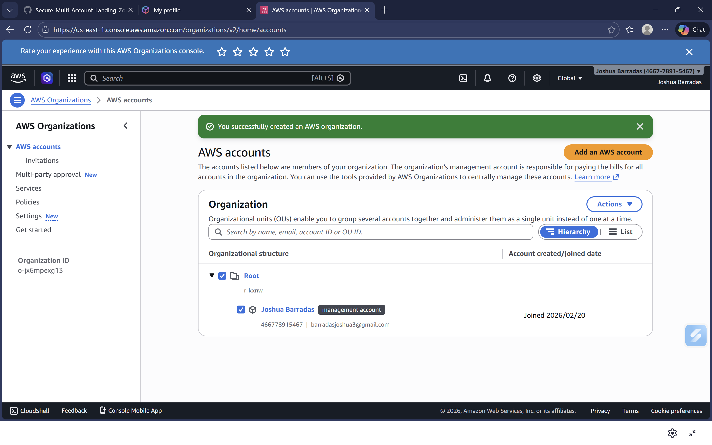
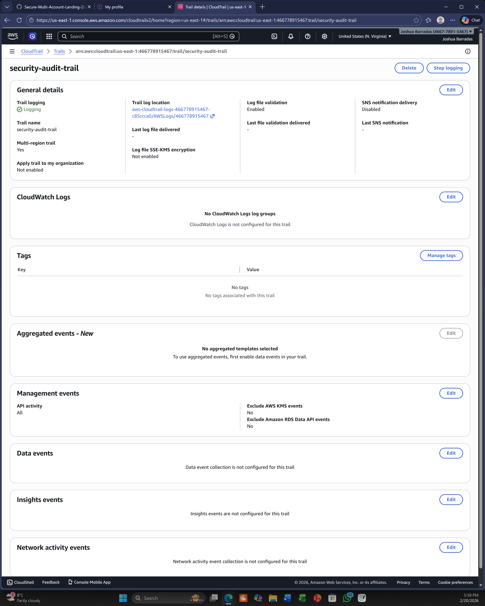
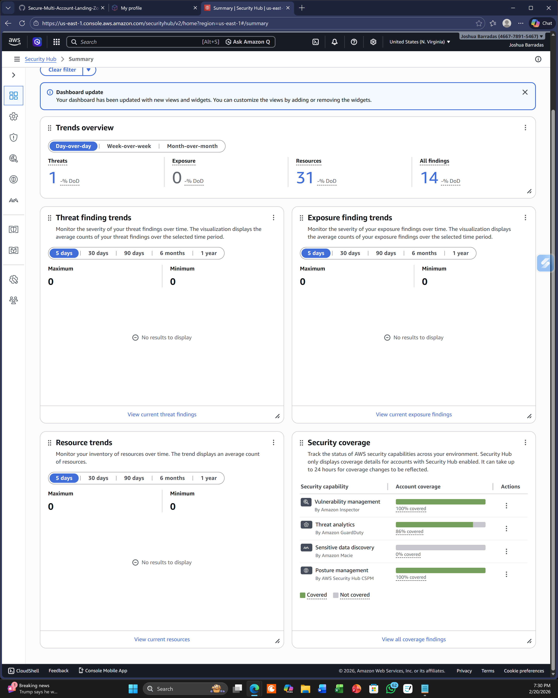
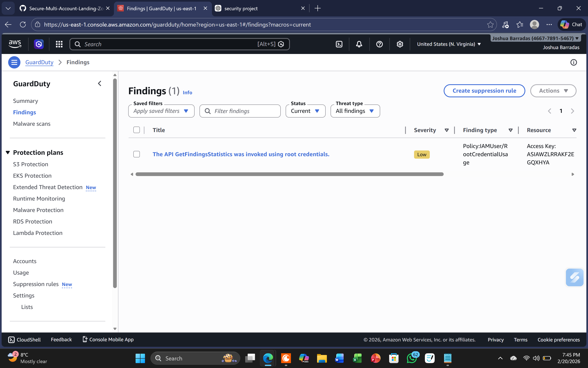
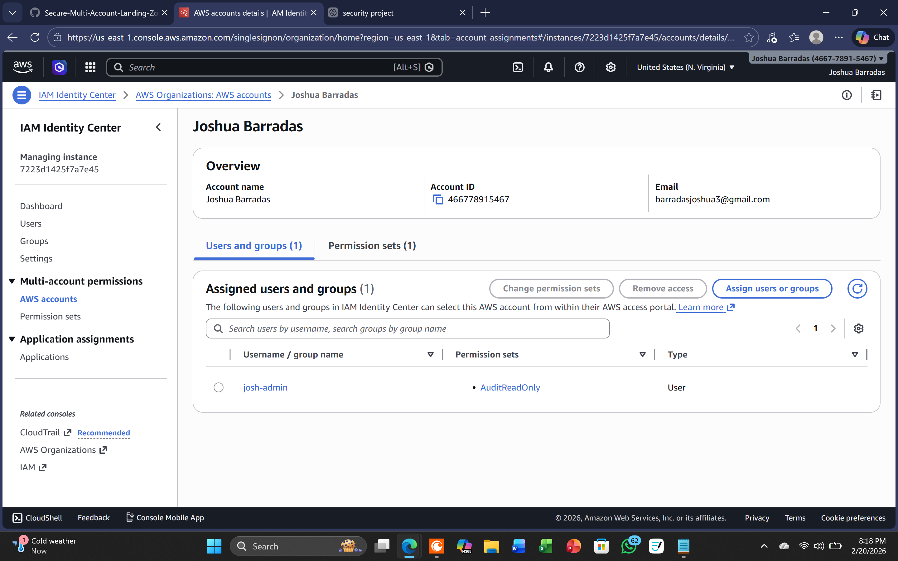
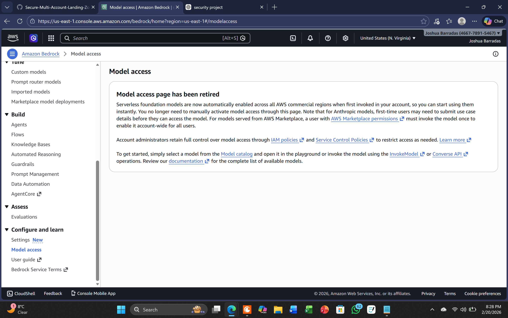
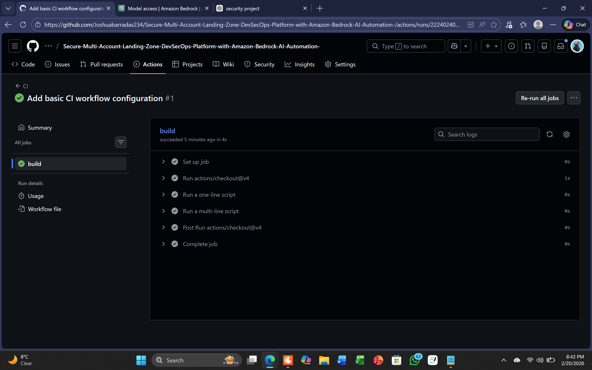
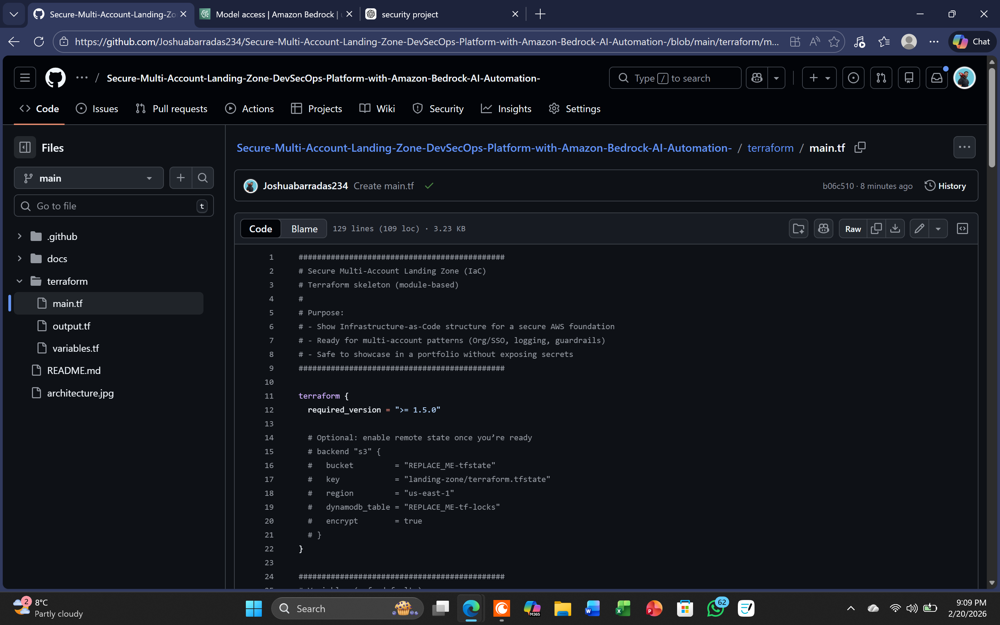

# Evidence pack (screenshots)

This folder contains audit-style evidence that the key security controls are configured.

> Note: sensitive identifiers (account IDs, ARNs, emails) are redacted.

## Evidence index

1. **Multi-account governance (AWS Organizations / OUs)**
- File: `evidence-01-org-accounts.png`
- What it proves: multi-account landing zone structure + governance separation.
- 

2. **Central logging (CloudTrail)**
- File: `evidence-02-cloudtrail.png`
- What it proves: API activity logged centrally for audit + investigations.
- 

3. **Security posture management (Security Hub)**
- File: `evidence-03-securityhub.png`
- What it proves: consolidated security posture + standards visibility.
- 

4. **Threat detection (GuardDuty)**
- File: `evidence-04-guardduty.png`
- What it proves: managed threat detection + actionable findings.
- 

5. **Access governance (IAM Identity Center / SSO)**
- File: `evidence-05-iam-identity-center.png`
- What it proves: centralized identity + permission sets (least privilege).
- 

6. **AI automation layer (Bedrock)**
- File: `evidence-06-bedrock.png`
- What it proves: model access / automation entry point for security workflows.
- 

7. **CI/CD proof (GitHub Actions)**
- File: `evidence-07-actions.png`
- What it proves: repeatable pipeline run + automation evidence.
- 

8. **IaC proof (Terraform)**
- File: `evidence-08-terraform.png`
- What it proves: infrastructure defined as code (plan/apply or modules).
- 
